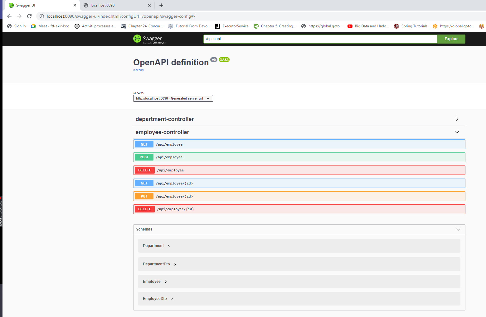
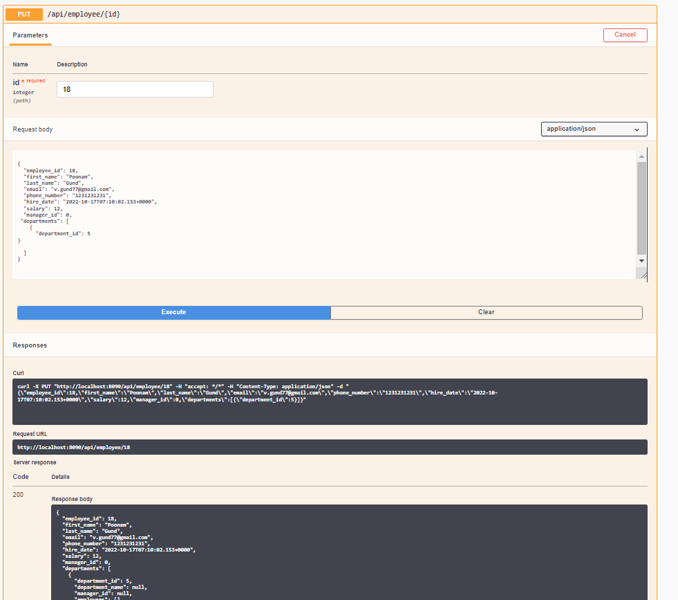
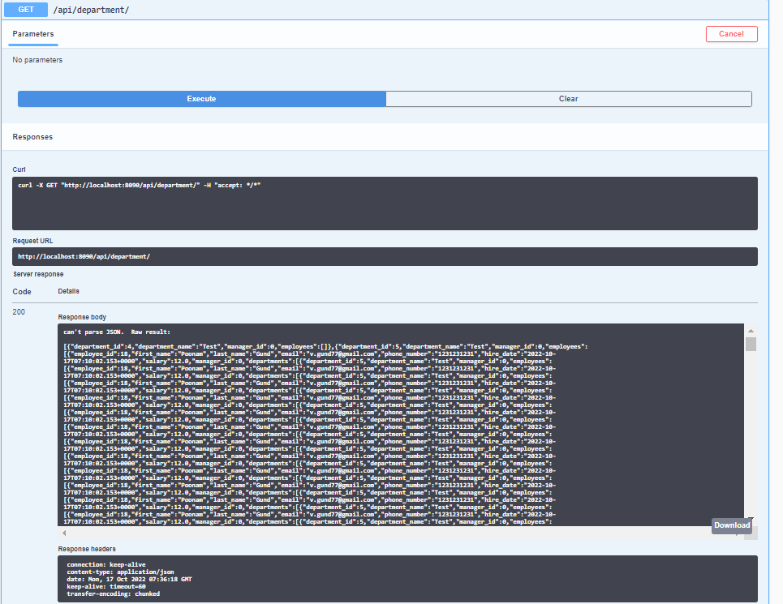
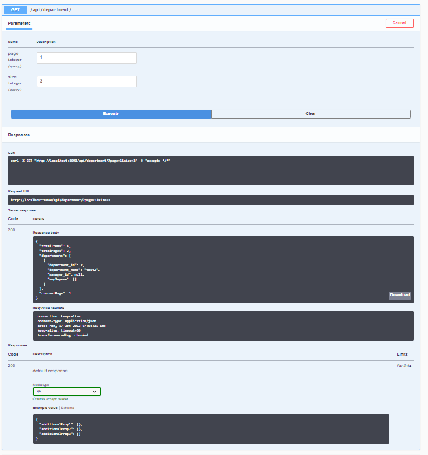

# Spring Boot H2 Database CRUD example

## Notes
Validator framework for validation of request
Data stored in H2 file data base (check application.properties)
Pagination Support

## Run Spring Boot application

```
mvn clean install
```

```
mvn spring-boot:run
```
and Open below URL for openAPI/swagger doc

http://localhost:8090/swagger-ui.html

## Please find below screenshots for some of operation





## Without Pagination


## With Pagination
